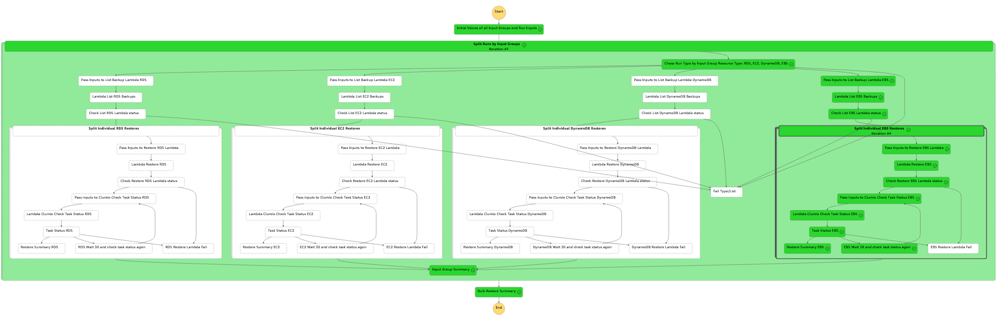

# Clumio Bulk Restore Automation

> [!IMPORTANT]
> Copyright 2024, Clumio, a Commvault Company.
> Licensed under the Apache License, Version 2.0 (the "License");
> you may not use this file except in compliance with the License.
> You may obtain a copy of the License at
>    http://www.apache.org/licenses/LICENSE-2.0
> Unless required by applicable law or agreed to in writing, software
> distributed under the License is distributed on an "AS IS" BASIS,
> WITHOUT WARRANTIES OR CONDITIONS OF ANY KIND, either express or implied.
> See the License for the specific language governing permissions and
> limitations under the License.

## What is a Bulk Restore
Bulk restores are used to restore multiple resources from different originating
locations (AWS account and region pairing) and/or times to one or more target
locations.

## How to use a Bulk Restore
Based upon the source definition, Clumio will find the set of appropriate
backups for identified resources and restore those resources using the user
provided target information.

## What information do I need to initiate a bulk restore
The inputs - in json format - required to run the bulk restore automation can be
defined ahead of time or easily crafted/updated when the restore is needed.
Inputs are in two different categories: source information and target information.

Source information can include AWS account, AWS Region, AWS resources tags, and
a datetime search window.

Target information is the resource specific AWS infrastructure elements running
in the target location that are required to deploy that specific type of AWS
resource. The only additional value you will need is a Clumio API token that
validates your permissions to run the automation based upon your Clumio login.

## What does the Clumio bulk restore use for this solution
To greatly simplify the process of running the recovery, the bulk restore
automation leverages a serverless architecture (AWS Lambda functions) and a
state machine (AWS StepFunctions). This scales out the recovery process to
initiate all restores at the same time.

Limits on the number of concurrent restores and the performance of those restores
are dependent upon the resource types being restored.
https://help.clumio.com/docs/clumio-service-limits

This solution can be deployed anywhere in AWS and does not need to have access to
either the original AWS source location or the target locations. Outside of the
AWS resources mentioned above, logging in AWS CloudWatch, a S3 bucket used
temporarily to deploy the solution; the only other AWS resource needed is an AWS
Secret which can optionally be used to store your Clumio API token.

## Files in this source repository

> [!NOTE]
> The files included in this github repository for information purposes only.
> This python code represents the contents of the lambda functions used by the
> state machine. This code along with non-default python packages are bundled in
> the ZIP file that is required to run the CFT.

> [!NOTE]
> JSON file example_step_function_inputs.json is an example of the inputs
> required to run the step function. These inputs would be modified to reflect
> your environment.


> [!NOTE]
> An IAM role that has permissions to execute the step function and the lambda
> functions (and to write to CloudWatch for logging purposes) must be
> identified/created before you deploy the CFT template. If required, you can
> modify the permission of this IAM role after all of the resources have been
> created to scope those permissions to achieve least privilege. If you use the
> AWS secret to store your Clumio api token, this IAM Role will also need to
> have read access to the secret.
> 
> The example of both the role trusted relationships and the policy can be found
> in examples folder.

> [!NOTE]
> The `clumio_bulk_restore_deploy_cft.yaml` file is the CloudFormation (CFT)
> deployment template. Deploy this CFT template to setup the solution.

## Build

To build you will need a Unix type shell (`bash`, `zsh`, ...), Python 3.12, `make` and `zip`.

```bash
make build
```

It will fetch the dependencies and generate the zip file `clumio_bulk_restore.zip`
under the `build` directory alongside the `clumio_bulk_restore_deploy_cft.yaml`
CloudFormation template.

The zip file must be uploaded to a S3 bucket where it can be accessed by the
CloudFormation Template when you deploy the solution.

## Running the Automation
> [!TIP]
> - [ ] Clumio backups must exist (and not be expired) for all resources that are to be restored.
> - [ ] Identify a S3 bucket where zip file can be copied.
> - [ ] Identify an IAM Role that has the ability to run both the lambda functions and the state machine.
> - [ ] Add an AWS secret which has the clumio api token to access clumio service.
> - [ ] Copy ZIP file from the git repository to the S3 bucket.
> - [ ] Run the CFT YAML file.  You will need to enter the S3 bucket and IAM role, AWS secret ARN as parameters to run the CFT YAML file.
> - [ ] Create an input JSON file for the state machine based upon the example JSON and the descriptions below.
> - [ ] Execute the State machine and pass it your input JSON.
> - [ ] If the input file has multiple restore sets, the restore automation will start multiple discovery threads.  One for each restore set.
> - [ ] Each Discovery thread will discovery a set of backups to be restored and will start separate restore threads for each backup.
> - [ ] Each restore thread will log a job status when the restore completes/fails.  This status will include information about the source of the restore.
> - [ ] The final step/state of the step function will show a combined status for every restore.



> [!WARNING]
> FOR EXAMPLE PURPOSES ONLY

## Input Definitions

| Base Input Parameter             | Description                                                                                                 |
| -------------------------------- | ---------------------------------------------------------------------------------------------------------   |
| bear                             | Clumio API bearer token https://help.clumio.com/docs/api-tokens                                             |
| debug                            | Set to a non-zero value to debug issues                                                                     |


| Source/Search Input Parameter    | Description                                                                                                 |
| -------------------------------- | ---------------------------------------------------------------------------------------------------------   |
| source_account                   | AWS account from which the ebs resources where backed up                                                    |
| source_region                    | AWS region from which the ebs resources where backed up                                                     |
| search_direction                 | When Choosing backups based upon a point in time look for backups "before" or "after" this point in time    |
|               "before"           | Set a search window from the point in time to the current time                                              |
|               "after"            | Set a search window from the point in time to the max search time                                           |
| end_search_day_offset            | If searching "before" a point in time this represents the offset from the current day to the point in time  |
| start_search_day_offset          | If searching "before" a point in time this is not used                                                      |
| start_search_day_offset          | If searching "after" a point in time this represents the offset from the current day to the point in time   |
| end_search_day_offset            | If searching "after" a point in time this represents the offset from the current day to the max search time |
| search_tag_key                   | If searching by AWS tag set search key and value                                                            |
| search_tag_value                 | If searching by AWS tag set search key and value                                                            |


| Target Input Parameter  EBS      | Description                                                                                                               |
| -------------------------------- |---------------------------------------------------------------------------------------------------------------------------|
| target_account                   | AWS account where the ebs resource is to be restored                                                                      |
| target_region                    | AWS region where the ebs resource is to be restored                                                                       |
| target_aws_az                    | required, infrastructure value for restore AWS AZ                                                                         |
| target_iops                      | optional, infrastructure value for EBS iops setting. Should only be use if target_volume_type is one of gp3, io1, or io2. |
| target_volume_type               | optional, infrastructure value for EBS volume type setting. Required if target_iops is set.                               |
| target_kms_key_native_id         | optional, infrastructure value for restore AWS KMS key id                                                                 |


| Target Input Parameter  RDS      | Description                                                                                                 |
| -------------------------------- | ---------------------------------------------------------------------------------------------------------   |
| target_account                   | AWS account where the ebs resource is to be restored                                                        |
| target_region                    | AWS region where the ebs resource is to be restored                                                         |
| target_subnet_group_name         | required, infrastructure value for RDS Subnet group name                                                    |
| target_rds_name                  | required, infrastructure value for RDS instance/cluster name                                                |
| target_security_group_native_id  | optional, infrastructure value for RDS Security Group List                                                  |
| target_kms_key_native_id         | optional, infrastructure value for RDS AWS KMS key id                                                       |


| Target Input Parameter  EC2      | Description                                                      |
| -------------------------------- |------------------------------------------------------------------|
| target_account                   | AWS account where the ebs resource is to be restored             |
| target_region                    | AWS region where the ebs resource is to be restored              |
| target_aws_az                    | required, infrastructure value for restore AWS AZ                |
| target_vpc_native_id             | required, infrastructure value for EC2 VPC id                    |
| target_subnet_native_id          | required, infrastructure value for EC2 Subnet id                 |
| target_kms_key_native_id         | optional, infrastructure value for EC2 AWS KMS key id            |
| target_iam_instance_profile_name | optional, infrastructure value for EC2 IAM instance profile name |
| target_key_pair_name             | optional, infrastructure value for EC2 Key pair name             |
| target_security_group_native_id  | optional, infrastructure value for EC2 Security Group List       |                                                                                                             |


| Target Input Parameter DynamoDB  | Description                                                                                                 |
| -------------------------------- | ---------------------------------------------------------------------------------------------------------   |
| target_account                   | AWS account where the ebs resource is to be restored                                                        |
| target_region                    | AWS region where the ebs resource is to be restored                                                         |
| change_set_name                  | required, infrastructure value for DynamoDB table name component                                            |


| Target Input Parameter ProtectionGroup | Description                                                                       |
|----------------------------------------|-----------------------------------------------------------------------------------|
| search_pg_name                         | Required. The name of protection group that the restore is going to be done from. |
| target_bucket                          | Required. The name of the bucket that the resource will be restored to.           |
| search_bucket_names                    | Optional. The list of bucket names within the protection group to be restored.    |
| search_object_filters                  | Optional. A specification dict to filter the objects to restore.                  |
| target_prefix                          | Optional. The prefix to add to the restored object.                               |

> [!NOTE]
> Optional infrastructure target values may still be required based upon the
> configuration of the original backed up resource.
